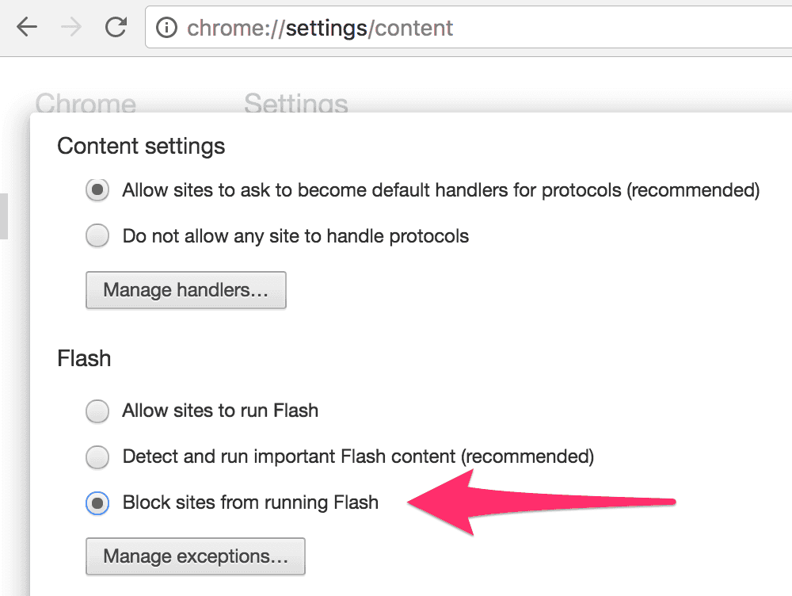

# detect-flash

A library to detect if Adobe Flash plugin is really alive in a web browser

This library actually runs a SWF file and then receives a signal from it.  Therefore, you can detect if Adobe Flash is actually available and working in the browser.

You can detect if Adobe Flash is installed in the browser by `navigator.plugins["Shockwave Flash"]`.  However, if you block a site from running Adobe Flash plugin like the image below, the plugin will not work.  This is the reason why I made this little library.



## Install

Install detect-flash via npm.

```sh
$ npm install detect-flash --save
```

## Usage

Pass the path to FlashDetector.swf and detect-flash returns a Promise object.  It is resolved only if Adobe Flash Plugin is actually alive.

```javascript
import detectFlash from 'detect-flash';

detectFlash('path-to-swf/FlashDetector.swf')
  .then(
    () => console.log('flash is alive.'),
    err => console.log('flash is not alive.')
  );
```

`detect-flash` waits until FlashDetector.swf returns a signal that Adobe Flash is alive, or `detect-flash` considers Flash plugin to be blocked if it times out.  Timeout for detection can be passed as the second argument.  The default value for timeout is `1000` milliseconds.

```javascript
// Set 3 seconds to timeout
detectFlash('path-to-swf/FlashDetector.swf', 3000)
  .catch(err => {
    console.log(
      'flash does not seem alive because detectFlash() did not receive the signal in 3 seconds.'
    );
  });
```

## Try a Demo

```sh
$ npm run demo
```
